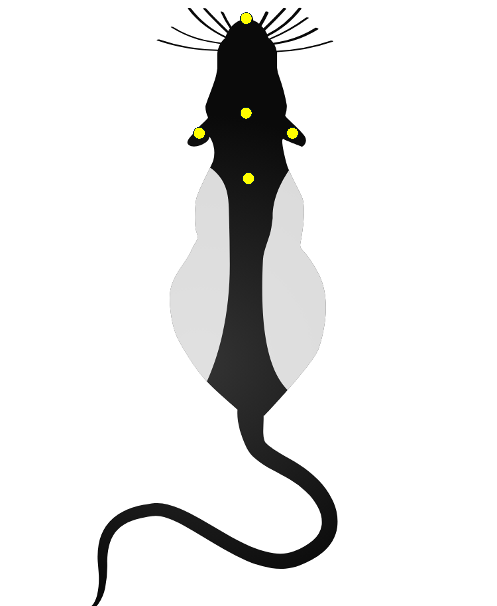
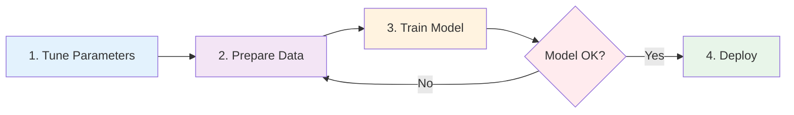
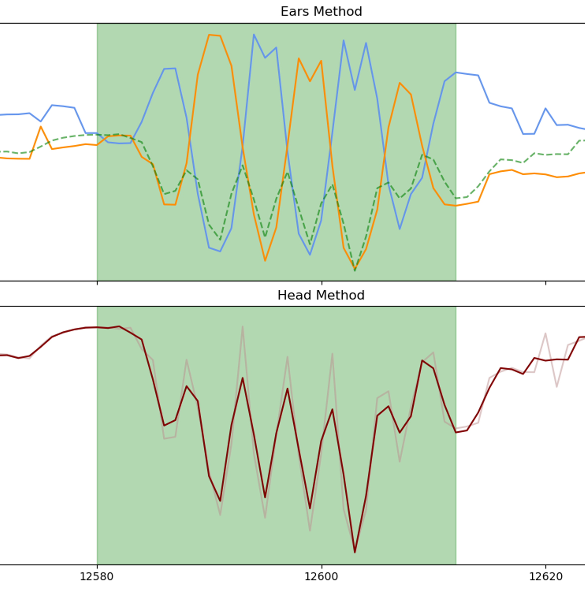

<p align="center">
  
</p>

# Head-Twitch Response Detection & Classification Tool

A comprehensive desktop application for detecting and analyzing Head-Twitch Responses (HTRs) in rodent behavioral videos using SLEAP pose-tracking data and machine learning. This tool provides a structured workflow from parameter tuning to model deployment.

## Installation

### Prerequisites

**Software:**
- Python 3.9 or higher
- Windows 10/11, macOS 10.14+, or Linux

**Data Requirements:**
- **Pose tracking data:** SLEAP-generated H5 files (`.h5` format)
  - *Note: Support for other pose estimation formats (DeepLabCut, etc.) planned for future releases*
- **Camera view:** Top-down view of the animal required
- **Bodypart labels:** Videos must be tracked with these 5 specific keypoints:
  - **Left Ear**
  - **Right Ear**
  - **Head** (center of head)
  - **Nose** (snout tip)
  - **Back** (base of neck/shoulders)

<p align="center">
  
  <br>
  <em>Required bodypart label placement (overhead view)</em>
</p>

*The tool uses ear and head movement patterns to detect HTR events*

### Quick Install

1. **Clone the repository**
   ```bash
   git clone https://github.com/GraysonButcher/Headtwitch_Detection_and_Classification.git
   cd Headtwitch_Detection_and_Classification
   ```

2. **Create a conda environment (recommended)**
   ```bash
   conda create -n htr python=3.10
   conda activate htr
   ```

   **Or use virtualenv:**
   ```bash
   python -m venv htr_env

   # Activate the virtual environment:
   # On Windows:
   htr_env\Scripts\activate
   # On macOS/Linux:
   source htr_env/bin/activate
   ```

3. **Install dependencies**
   ```bash
   pip install -r requirements.txt
   ```

4. **Launch the application**
   ```bash
   python test_gui_v3.py
   ```

👉 **For detailed installation instructions and troubleshooting**, see [docs/installation.md](docs/installation.md) (coming soon)

## Quick Start

**5-Minute Walkthrough:**

1. Launch the application: `python test_gui_v3.py`
2. Create/Open a project: **File → New Project**
3. Navigate through the 5-tab workflow (see below)

## Workflow Overview



👉 **[View detailed workflow with decision points →](docs/workflow.md)**


## How HTR Detection Works

**Required Setup:** The detection algorithms require SLEAP H5 tracking data with 5 specific bodyparts (Left Ear, Right Ear, Head, Nose, Back) filmed from a top-down camera angle.

| Column 1                                                                              |                                                                        Column 2        |
|---------------------------------------------------------------------------------------|----------------------------------------------------------------------------------------|
| Text or image here                                                                    |                           Text or image here                                           |

<p align="center">
  
  <br>
  <em>Dual detection methods: Ear oscillations (top) and head oscillations (bottom) with detected events highlighted</em>
</p>

The tool uses **two complementary detection methods**:


### **1. Ear Detector**
Analyzes rapid oscillations in the distance between left and right ears.
- Detects "crisscross" patterns when ears move independently
- Configurable thresholds for peak/valley detection
- Gap tolerance for fragmented events

### **2. Head Detector**
Detects rapid head position changes relative to body midline.
- Uses amplitude and frequency analysis of head oscillations
- Smoothing and cycle detection for noise filtering
- Prominence-based peak detection

**Event Confidence Levels:**
- **Combined (Green)**: Detected by both methods → High confidence
- **Ear Only (Orange)**: Detected by ear method only → Medium confidence
- **Head Only (Red)**: Detected by head method only → Medium confidence

Events are then classified using a trained XGBoost model that learns from user-labeled ground truth data.

## Documentation

| Guide | Status | Description |
|-------|--------|-------------|
| **[Setup Guide](docs/setup_guide.md)** | ✅ Available | Hardware setup, camera configuration, SLEAP tracking |
| **[How H-DaC Works](docs/detection_methods.md)** | ✅ Available | Detailed explanation of dual detection methods |
| **[Workflow Guide](docs/workflow.md)** | ✅ Available | Complete end-to-end workflow with decision points |
| **[Installation Guide](docs/installation.md)** | 🚧 Coming Soon | Detailed software installation, conda/pip, troubleshooting |
| **[Quick Start Tutorial](docs/quickstart.md)** | 🚧 Coming Soon | 5-minute first-run walkthrough |
| **[Parameter Tuning Guide](docs/parameter_tuning_guide.md)** | 🚧 Coming Soon | Understanding and adjusting detection parameters |
| **[FAQ & Troubleshooting](docs/faq.md)** | 🚧 Coming Soon | Common questions and issues |

📹 **Video Tutorials** - Coming soon!

## Configuration

### Node Mapping

SLEAP exports can have different node orderings. Configure the correct mapping via:
- **Settings > Configure Node Mapping**

Common formats:
- Format 1: Left Ear=0, Right Ear=1, Back=2, Nose=3, Head=4
- Format 2: Nose=0, Head=1, Left Ear=2, Right Ear=3, Back=4

### Parameter Files

Detection parameters can be saved and loaded as JSON files:
- **File > Export Parameters**: Save current parameter configuration
- **File > Import Parameters**: Load saved parameter configuration

## Troubleshooting

### Common Issues

1. **Import Errors**: Ensure all dependencies are installed with `pip install -r requirements.txt`
2. **H5 File Errors**: Verify your H5 files are valid SLEAP exports with `tracks` and `point_scores` datasets
3. **Node Mapping Issues**: Check that node indices match your SLEAP export format
4. **Performance Issues**: For large datasets, consider processing files in smaller batches

### Getting Help

- Run `python test_app.py` to verify your installation
- Check the console output for detailed error messages
- Ensure your H5 files contain the required SLEAP datasets

## Requirements

See `requirements.txt` for the complete list of dependencies. Key requirements include:

- PySide6 (GUI framework)
- OpenCV (video processing)  
- scikit-learn & XGBoost (machine learning)
- matplotlib & seaborn (plotting)
- pandas & numpy (data processing)
- h5py (HDF5 file reading)

## Project Structure

The application is structured with a modular architecture:

- `core/`: Backend modules for detection algorithms, ML models, and data processing
- `gui_v2/`: PySide6 GUI components (tabs, widgets, dialogs)
- `test_gui_v3.py`: Application entry point (v3)
- `docs/`: Documentation and guides (coming soon)
- `examples/`: Sample data and configurations (coming soon)

## Citation

If you use this tool in your research, please cite:

```bibtex
@software{htr_analysis_tool_2025,
  author = {Butcher, Grayson},
  title = {Head-Twitch Response Detection and Classification Tool},
  year = {2025},
  url = {https://github.com/GraysonButcher/Headtwitch_Detection_and_Classification}
}
```

## License

This project is licensed under the MIT License - see [LICENSE](LICENSE) file for details.

## Contributing

Contributions are welcome! Please feel free to:
- Report bugs or request features via [GitHub Issues](https://github.com/GraysonButcher/Headtwitch_Detection_and_Classification/issues)
- Submit pull requests with improvements
- Share your parameter configurations or training data

## Support

- 🐛 **Issues**: [GitHub Issues](https://github.com/GraysonButcher/Headtwitch_Detection_and_Classification/issues)
- 💬 **Discussions**: [GitHub Discussions](https://github.com/GraysonButcher/Headtwitch_Detection_and_Classification/discussions)

---

**Status**: Active Development | **Version**: 3.0 | **Last Updated**: January 2025
