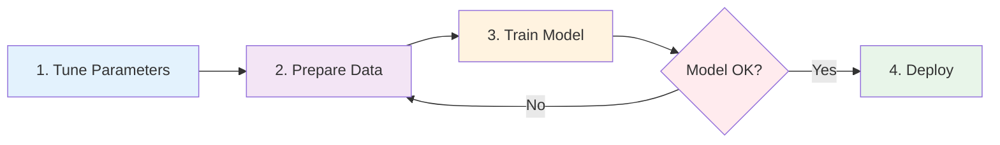

<p align="center">
  
</p>

# Head-Twitch Response Detection & Classification Tool

A comprehensive desktop application for detecting and analyzing Head-Twitch Responses (HTRs) in rodent behavioral videos using SLEAP pose-tracking data and machine learning. This tool provides a structured 5-tab workflow from parameter tuning to model deployment.

## Features

- 🎯 **Real-time Parameter Tuning**: Adjust detection parameters with immediate video/signal feedback
- 📊 **Dual Detection Methods**: Combines ear movement and head oscillation detection
- 🤖 **Machine Learning Pipeline**: Complete workflow for training and applying XGBoost classifiers
- 📦 **Smart Batch Processing**: Fresh and incremental processing modes
- 🎨 **Built-in CSV Editor**: Label ground truth data directly in the application
- 📈 **Interactive Visualization**: Real-time signal plots with event overlays
- 🔄 **Model Iteration Tools**: Evaluate performance, review misclassified events, and retrain

## Installation

### Prerequisites

- Python 3.9 or higher
- SLEAP-generated H5 pose tracking files
- Windows 10/11, macOS 10.14+, or Linux

### Quick Install

1. **Clone the repository**
   ```bash
   git clone https://github.com/GraysonButcher/Headtwitch_Detection_and_Classification.git
   cd Headtwitch_Detection_and_Classification
   ```

2. **Create a conda environment (recommended)**
   ```bash
   conda create -n htr python=3.10
   conda activate htr
   ```

   **Or use virtualenv:**
   ```bash
   python -m venv htr_env

   # Activate the virtual environment:
   # On Windows:
   htr_env\Scripts\activate
   # On macOS/Linux:
   source htr_env/bin/activate
   ```

3. **Install dependencies**
   ```bash
   pip install -r requirements.txt
   ```

4. **Launch the application**
   ```bash
   python test_gui_v3.py
   ```

👉 **For detailed installation instructions and troubleshooting**, see [docs/installation.md](docs/installation.md) (coming soon)

## Quick Start

**5-Minute Walkthrough:**

1. Launch the application: `python test_gui_v3.py`
2. Create/Open a project: **File → New Project**
3. Navigate through the 5-tab workflow (see below)

## Workflow Overview



👉 **[View detailed workflow with decision points →](docs/workflow.md)**

The application provides a structured 5-tab workflow for HTR detection and analysis:

### **Tab 1: Welcome**

Your starting point - provides project overview and quick navigation to key workflow stages.

- View workflow cards with status indicators
- Quick-jump to Tune Parameters, Prepare Data, Train Model, or Deploy
- Project information and recent activity

### **Tab 2: Tune Parameters**

Real-time parameter tuning with video feedback.

**Features:**
- Load video (.mp4, .avi) and SLEAP H5 tracking file
- Interactive signal visualization (left ear, right ear, head→midline distance)
- Real-time parameter adjustment panel (Ear Detector, Head Detector, General Settings)
- Reanalyze current view or full video with new parameters
- Event detection overlays color-coded by method:
  - **Green**: Combined (both methods)
  - **Orange**: Ear detector only
  - **Red**: Head detector only
- Save/load parameter configurations

**Workflow:**
1. Load H5 file (configure node mapping in dialog)
2. Load corresponding video
3. Adjust detection parameters while viewing signal plots
4. Click "Reanalyze Current View" for fast feedback
5. Click "Reanalyze Full Video" once satisfied
6. Save optimized parameters for feature extraction

### **Tab 3: Prepare Data**

Feature extraction and ground truth labeling.

**Features:**
- Extract features from H5 files using tuned parameters
- Built-in CSV editor for ground truth labeling
- Mark events as HTR (1) or non-HTR (0)
- Prepare balanced training datasets

**Workflow:**
1. Select input folder containing H5 files
2. Extract features → generates feature CSV files
3. Open CSV files in built-in editor
4. Label ground truth for each candidate event
5. Save labeled data for model training

### **Tab 4: Train Model**

Machine learning model training and evaluation.

**Features:**
- Train XGBoost classifier on labeled data
- Cross-validation with 80/20 train/test split
- Performance metrics (accuracy, precision, recall, F1-score)
- Confusion matrix visualization
- Misclassified events analysis
- Iterative improvement workflow

**Workflow:**
1. Load labeled CSV file (ground truth)
2. Optionally load parameter configuration
3. Train model → generates .joblib model file
4. Review performance metrics
5. Load misclassified events to identify labeling errors
6. Fix labels in Prepare Data tab → retrain → improve accuracy

### **Tab 5: Deploy**

Batch processing for production analysis.

**Features:**
- **Fresh Processing**: Analyze new videos from scratch
- **Incremental Processing**: Add new videos to existing results
- Smart duplicate detection
- Progress tracking for large batches
- Export results to CSV

**Workflow:**
1. Select processing mode (Fresh or Incremental)
2. Choose input folder with H5 files
3. Load trained model (.joblib)
4. Load parameter configuration (optional)
5. Run batch processing
6. Review output CSV with HTR detection results

## How HTR Detection Works

The tool uses **two complementary detection methods**:

### **1. Ear Detector**
Analyzes rapid oscillations in the distance between left and right ears.
- Detects "crisscross" patterns when ears move independently
- Configurable thresholds for peak/valley detection
- Gap tolerance for fragmented events

### **2. Head Detector**
Detects rapid head position changes relative to body midline.
- Uses amplitude and frequency analysis of head oscillations
- Smoothing and cycle detection for noise filtering
- Prominence-based peak detection

**Event Confidence Levels:**
- **Combined (Green)**: Detected by both methods → High confidence
- **Ear Only (Orange)**: Detected by ear method only → Medium confidence
- **Head Only (Red)**: Detected by head method only → Medium confidence

Events are then classified using a trained XGBoost model that learns from user-labeled ground truth data.

## Documentation

| Guide | Status | Description |
|-------|--------|-------------|
| **[Installation Guide](docs/installation.md)** | 🚧 Coming Soon | Detailed setup, conda/pip, troubleshooting |
| **[Quick Start Tutorial](docs/quickstart.md)** | 🚧 Coming Soon | 5-minute first-run walkthrough |
| **[Parameter Tuning Guide](docs/parameter_tuning_guide.md)** | 🚧 Coming Soon | Understanding and adjusting detection parameters |
| **[Workflow Guide](docs/workflow.md)** | ✅ Available | Complete end-to-end workflow with decision points |
| **[FAQ & Troubleshooting](docs/faq.md)** | 🚧 Coming Soon | Common questions and issues |

📹 **Video Tutorials** - Coming soon!

## Configuration

### Node Mapping

SLEAP exports can have different node orderings. Configure the correct mapping via:
- **Settings > Configure Node Mapping**

Common formats:
- Format 1: Left Ear=0, Right Ear=1, Back=2, Nose=3, Head=4
- Format 2: Nose=0, Head=1, Left Ear=2, Right Ear=3, Back=4

### Parameter Files

Detection parameters can be saved and loaded as JSON files:
- **File > Export Parameters**: Save current parameter configuration
- **File > Import Parameters**: Load saved parameter configuration

## Troubleshooting

### Common Issues

1. **Import Errors**: Ensure all dependencies are installed with `pip install -r requirements.txt`
2. **H5 File Errors**: Verify your H5 files are valid SLEAP exports with `tracks` and `point_scores` datasets
3. **Node Mapping Issues**: Check that node indices match your SLEAP export format
4. **Performance Issues**: For large datasets, consider processing files in smaller batches

### Getting Help

- Run `python test_app.py` to verify your installation
- Check the console output for detailed error messages
- Ensure your H5 files contain the required SLEAP datasets

## Requirements

See `requirements.txt` for the complete list of dependencies. Key requirements include:

- PySide6 (GUI framework)
- OpenCV (video processing)  
- scikit-learn & XGBoost (machine learning)
- matplotlib & seaborn (plotting)
- pandas & numpy (data processing)
- h5py (HDF5 file reading)

## Project Structure

The application is structured with a modular architecture:

- `core/`: Backend modules for detection algorithms, ML models, and data processing
- `gui_v2/`: PySide6 GUI components (tabs, widgets, dialogs)
- `test_gui_v3.py`: Application entry point (v3)
- `docs/`: Documentation and guides (coming soon)
- `examples/`: Sample data and configurations (coming soon)

## Citation

If you use this tool in your research, please cite:

```bibtex
@software{htr_analysis_tool_2025,
  author = {Butcher, Grayson},
  title = {Head-Twitch Response Detection and Classification Tool},
  year = {2025},
  url = {https://github.com/GraysonButcher/Headtwitch_Detection_and_Classification}
}
```

## License

This project is licensed under the MIT License - see [LICENSE](LICENSE) file for details.

## Contributing

Contributions are welcome! Please feel free to:
- Report bugs or request features via [GitHub Issues](https://github.com/GraysonButcher/Headtwitch_Detection_and_Classification/issues)
- Submit pull requests with improvements
- Share your parameter configurations or training data

## Support

- 🐛 **Issues**: [GitHub Issues](https://github.com/GraysonButcher/Headtwitch_Detection_and_Classification/issues)
- 💬 **Discussions**: [GitHub Discussions](https://github.com/GraysonButcher/Headtwitch_Detection_and_Classification/discussions)

---

**Status**: Active Development | **Version**: 3.0 | **Last Updated**: January 2025