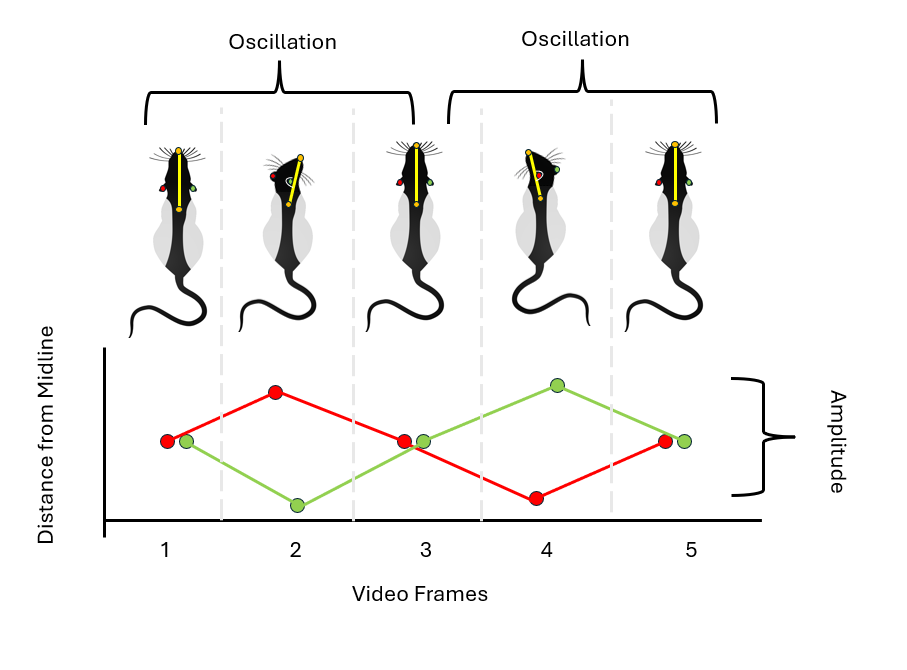
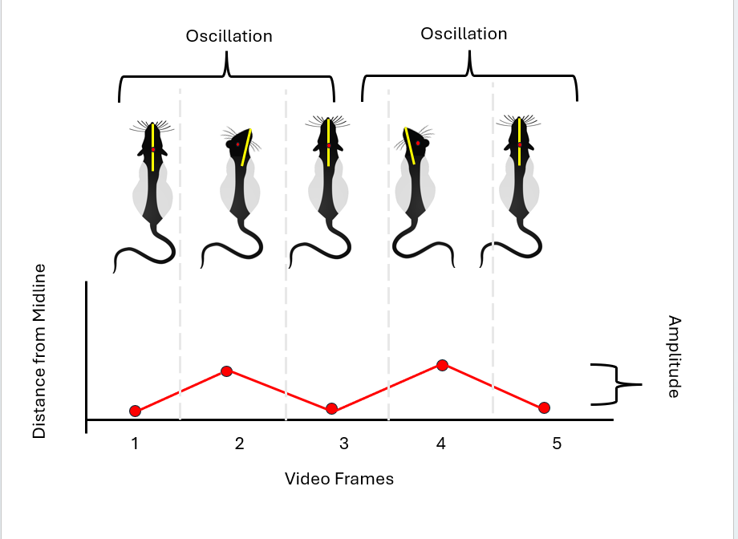
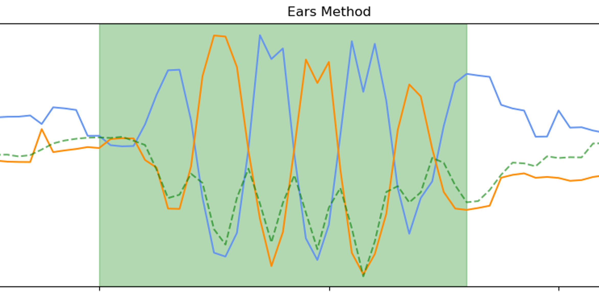
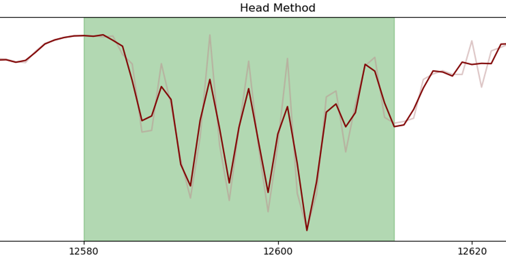

<p align="center">
  
</p>

# Head-Twitch Response Detection & Classification Tool

A comprehensive desktop application for detecting and analyzing Head-Twitch Responses (HTRs) in rodent behavioral videos using SLEAP pose-tracking data and machine learning. This tool provides a structured workflow from parameter tuning to model deployment.

---

## Prerequisites

**Software:**
- Python 3.9 or higher
- Windows 10/11, macOS 10.14+, or Linux

**Data Requirements:**
- **Pose tracking data:** SLEAP-generated H5 files (`.h5` format)
  - *Note: Support for other pose estimation formats (DeepLabCut, etc.) planned for future releases*
- **Camera view:** Top-down view of the animal required
- **Bodypart labels:** Videos must be tracked with these 5 specific keypoints:
  - Left Ear, Right Ear, Nose, Head, Back


<p align="center">
  
  <br>
  <em>Required bodypart label placement (overhead view)</em>
</p>

---

## Quick Install

```bash
git clone https://github.com/GraysonButcher/Headtwitch_Detection_and_Classification.git
cd Headtwitch_Detection_and_Classification
python -m venv htr_env
htr_env\Scripts\activate  # On Windows
pip install -e .
hdac  # Launch the application
```

👉 **[Full installation guide with all options →](docs/installation.md)** (conda, manual setup, troubleshooting)

---

## Using H-DaC

### Scenario 1: [Ready to Predict HTRs](docs/workflow.md#deployment-fresh)
(Choose this scenario if you already have tuned detection parameters and a trained model) 
1. **(Jump to) New Project** → [Deployment Guide: Fresh Start](docs/workflow.md#deployment-fresh)
2. **(Jump to) Existing Project** → [Deployment Guide: Incremental Analysis](docs/workflow.md#deployment-incremental)

### Scenario 2: [Need to Prepare Your Detection System](docs/workflow.md#prepare-data)
(Choose this scenario if you're starting completely fresh or haven't finished tuning
parameters, labeling data, or training a model)
1. **(Jump to) Tune detection parameters** → [Parameter Tuning Guide](docs/parameter_tuning_guide.md)
2. **(Jump to) Label ground truth data** → [Ground Truth Labeling Guide](docs/workflow.md#prepare-data)
3. **(Jump to) Train your model** → [Model Training Guide](docs/workflow.md#train-model)

---

## How Does H-DaC Work?
**Understanding the detection methods:**

The tool uses **two complementary detection methods** to identify HTR events:

| *Ear Detector Approach* | *Head Detector Approach* |
|:--:|:--:|
|  |  |
| *Real Ear Example* | *Real Head Example* |
|  |  |

**Event Confidence Levels:**
- **Combined (Green)**: Detected by both methods → High confidence
- **Ear Only (Orange)**: Detected by ear method only → Medium confidence
- **Head Only (Red)**: Detected by head method only → Medium confidence

Events are classified using a trained XGBoost model that learns from user-labeled ground truth data.

👉 **[Read detailed methods documentation →](docs/detection_methods.md)**

### Need Help?
- **❓ Common issues and solutions** → [FAQ & Troubleshooting](docs/faq.md)
- **🐛 Report a bug** → [GitHub Issues](https://github.com/GraysonButcher/Headtwitch_Detection_and_Classification/issues)
- **💬 Ask questions** → [GitHub Discussions](https://github.com/GraysonButcher/Headtwitch_Detection_and_Classification/discussions)

---

## Documentation

Complete documentation available in the [`/docs`](docs/) directory:

| Guide | Status | Description |
|-------|--------|-------------|
| **[Setup Guide](docs/setup_guide.md)** | ✅ Available | Hardware setup, camera configuration, SLEAP tracking |
| **[Detection Methods](docs/detection_methods.md)** | ✅ Available | Detailed explanation of dual detection methods |
| **[Workflow Guide](docs/workflow.md)** | ✅ Available | Complete end-to-end workflow with decision points |
| **[Installation Guide](docs/installation.md)** | 🚧 Coming Soon | Detailed software installation options and troubleshooting |
| **[Parameter Tuning Guide](docs/parameter_tuning_guide.md)** | 🚧 Coming Soon | Understanding and adjusting detection parameters |
| **[FAQ & Troubleshooting](docs/faq.md)** | 🚧 Coming Soon | Common questions and issues |

📹 **Video Tutorials** - Coming soon!

---

## Configuration

### Node Mapping

SLEAP exports can have different node orderings. Configure via **Settings > Configure Node Mapping**.

Common formats:
- Format 1: Left Ear=0, Right Ear=1, Back=2, Nose=3, Head=4
- Format 2: Nose=0, Head=1, Left Ear=2, Right Ear=3, Back=4

### Parameter Files

Detection parameters can be saved and loaded as JSON files:
- **File > Export Parameters**: Save current parameter configuration
- **File > Import Parameters**: Load saved parameter configuration

---

## Citation

If you use this tool in your research, please cite:

```bibtex
@software{htr_analysis_tool_2025,
  author = {Butcher, Grayson},
  title = {Head-Twitch Response Detection and Classification Tool},
  year = {2025},
  url = {https://github.com/GraysonButcher/Headtwitch_Detection_and_Classification}
}
```

---

## License

This project is licensed under the MIT License - see [LICENSE](LICENSE) file for details.

## Contributing

Contributions are welcome! Please feel free to:
- Report bugs or request features via [GitHub Issues](https://github.com/GraysonButcher/Headtwitch_Detection_and_Classification/issues)
- Submit pull requests with improvements
- Share your parameter configurations or training data

---

**Status**: Active Development | **Version**: 3.0.0 | **Last Updated**: January 2025
