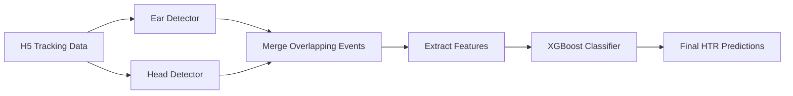

# How H-DaC Detection Works

Detailed explanation of the dual detection methodology used in H-DaC for identifying Head-Twitch Response events.

---

## Overview

H-DaC uses **two complementary detection methods** to identify HTR events from pose-tracking data:

1. **Ear Detector** - Analyzes rapid oscillations in ear positions
2. **Head Detector** - Analyzes head movement patterns relative to body midline

Events detected by both methods are considered high-confidence HTRs. Single-method detections are flagged for review during parameter tuning.

---

## Method 1: Ear Detector

The ear detector identifies the characteristic "ear oscillation" pattern of HTR events.

  
   
  <em>Ear detector analyzes the crisscross pattern of left (red) and right (green) ear distances from body midline</em>

### How It Works

1. **Calculate ear distances** from body midline for each frame
2. **Detect peaks and valleys** in both left and right ear signals
3. **Identify "crisscross" patterns** where ears oscillate out of phase
4. **Count oscillations** within the event window
5. **Merge nearby events** based on gap tolerance

### Key Parameters

- **Peak/Valley Thresholds** - Minimum distance change to count as oscillation
- **Minimum Oscillations** - Required number of crisscrosses (typically 2-3)
- **Max Gap** - Maximum frames between oscillations to merge into one event
- **Min Event Duration** - Shortest valid HTR event

### Why This Works

During an HTR event, the mouse rapidly shakes its head, causing the ears to move independently in a characteristic oscillating pattern. The ears alternate moving away from and toward the body midline, creating the crisscross signal.

---

## Method 2: Head Detector

The head detector identifies rapid head position changes relative to the body midline.

  
   
  <em>Head detector analyzes rapid oscillations in head position relative to body midline</em>

### How It Works

1. **Calculate head distance** from body midline (back→nose line)
2. **Apply smoothing** to reduce tracking noise
3. **Detect oscillation cycles** using prominence-based peak detection
4. **Measure amplitude** of head movements
5. **Identify rapid sequences** of oscillations

### Key Parameters

- **Amplitude Threshold** - Minimum head movement distance
- **Prominence** - Peak detection sensitivity
- **Smoothing Window** - Noise reduction (Savitzky-Golay filter)
- **Min Cycle Count** - Required number of oscillations
- **Max Cycle Gap** - Maximum frames between cycles

### Why This Works

HTR events involve rapid, high-amplitude head shaking. The head moves laterally relative to the body's long axis, creating a distinctive oscillation pattern in the perpendicular distance from the body midline.

---

## Combined Detection

  
   
  <em>Combined view showing both detection methods on the same time series</em>

### Detection Confidence Levels

Events are classified by detection method overlap:

| Confidence | Color | Detected By | Use Case |
|------------|-------|-------------|----------|
| **High** | Green | Both methods | Clear HTR events |
| **Medium** | Orange | Ear only | Review during tuning |
| **Medium** | Red | Head only | Review during tuning |

### Intersection over Union (IoU)

When both methods detect overlapping events, H-DaC calculates the temporal overlap (IoU) to determine if they represent the same HTR:

- **IoU > threshold** (default 0.3): Events merged → "Combined" detection
- **IoU < threshold**: Events remain separate → Single-method detections

---

## Machine Learning Classification

After rule-based detection, H-DaC uses **XGBoost** to classify detected candidates as true HTRs or false positives.

### Features Extracted

For each candidate event, H-DaC extracts 35+ features including:

**Temporal Features:**
- Event duration
- Number of oscillations
- Inter-oscillation gaps

**Amplitude Features:**
- Peak/valley heights
- Movement amplitudes
- Signal variance

**Detection Features:**
- Which method(s) detected it
- IoU overlap score
- Confidence scores

### Training Process

1. User labels candidate events as HTR (1) or not HTR (0)
2. XGBoost trains on labeled features
3. Model predicts on new unlabeled data
4. User reviews misclassified events and improves labels
5. Iterative refinement improves accuracy

---

## Detection Pipeline Summary

---

## Best Practices

### Parameter Tuning
- Start with default parameters
- Adjust based on visual feedback in Tab 2
- Balance sensitivity vs. false positive rate
- Document final parameters for reproducibility

### Quality Control
- Visually verify a sample of detections
- Check for consistent tracking quality
- Review edge cases (partial HTRs, head scratches)
- Validate across different lighting/arena conditions

### Model Training
- Label balanced dataset (50% HTR, 50% non-HTR)
- Include diverse examples (different amplitudes, durations)
- Iterate: train → evaluate → fix labels → retrain
- Aim for F1-score > 0.85

---

## Related Documentation

- **[Parameter Tuning Guide](parameter_tuning_guide.md)** - Adjust detection parameters
- **[Workflow Guide](workflow.md)** - Complete analysis workflow
- **[Setup Guide](setup_guide.md)** - Hardware and data preparation

---

*Last Updated: January 2025*
