# Experimental Workflow Diagrams

Different visualization approaches for the HTR analysis workflow. Evaluate which one is most intuitive.

---

## Current Diagrams (For Comparison)

### Current Simple Diagram (README)

### Current Detailed Diagram (docs/workflow.md)

```mermaid
flowchart TD
    Start([New HTR Project]) --> HasParams{Have Good<br/>Parameters?}

    HasParams -->|No| Tune[🎯 TUNE PARAMETERS<br/>Tab 2<br/>━━━━━━━━━━<br/>• Load H5/video<br/>• Adjust params<br/>• Visual verify<br/>• Save params]
    HasParams -->|Yes| Extract

    Tune --> Extract[📊 EXTRACT FEATURES<br/>Tab 3: Prepare Data<br/>━━━━━━━━━━<br/>• Load H5 files<br/>• Apply parameters<br/>• Generate CSVs]

    Extract --> HasModel{Have Trained<br/>ML Model?}

    HasModel -->|Yes| Deploy
    HasModel -->|No| HasLabels{Have Ground<br/>Truth Labels?}

    HasLabels -->|Yes| Train
    HasLabels -->|No| Label[🎨 LABEL GROUND TRUTH<br/>Tab 3: CSV Editor<br/>━━━━━━━━━━<br/>• Watch video<br/>• Note HTR times<br/>• Convert to frames<br/>• Edit CSV:<br/>  - 1 = HTR<br/>  - 0 = not HTR]

    Label --> LabelReady{Labeling<br/>Complete?}
    LabelReady -->|No| Label
    LabelReady -->|Yes| Train

    Train[🤖 ML MODEL TRAINING<br/>Tab 4<br/>━━━━━━━━━━<br/>• Load labeled CSVs<br/>• GridSearchCV XGBoost<br/>• Generate model .joblib<br/>• Confusion matrix<br/>• Misclassified CSV] --> Evaluate[📈 EVALUATE<br/>PERFORMANCE<br/>━━━━━━━━━━<br/>• Review confusion matrix<br/>• Check FN misses<br/>• Check FP false alarms]

    Evaluate --> ModelOK{Performance<br/>Acceptable?}

    ModelOK -->|No| Refine[🔄 ITERATIVE REFINEMENT<br/>━━━━━━━━━━<br/>• Review misclassified events<br/>• Watch videos<br/>• Fix label errors<br/>• Add more training data]
    Refine --> Train

    ModelOK -->|Yes| Deploy[🚀 DEPLOY<br/>Tab 5: Batch Processing<br/>━━━━━━━━━━<br/>• Fresh or Incremental mode<br/>• Extract features<br/>• Run predictions<br/>• Generate reports]

    Deploy --> Done([✅ Analysis Complete!])

    style Start fill:#e8f5e9,stroke:#4caf50,stroke-width:3px
    style Tune fill:#e3f2fd,stroke:#2196f3,stroke-width:2px
    style Extract fill:#f3e5f5,stroke:#9c27b0,stroke-width:2px
    style Label fill:#fff3e0,stroke:#ff9800,stroke-width:2px
    style Train fill:#ffe0b2,stroke:#ff5722,stroke-width:2px
    style Evaluate fill:#ffccbc,stroke:#ff5722,stroke-width:2px
    style Refine fill:#ffebee,stroke:#f44336,stroke-width:2px
    style Deploy fill:#c8e6c9,stroke:#4caf50,stroke-width:2px
    style Done fill:#a5d6a7,stroke:#4caf50,stroke-width:3px

    style HasParams fill:#fff9c4,stroke:#fbc02d,stroke-width:2px
    style HasModel fill:#fff9c4,stroke:#fbc02d,stroke-width:2px
    style HasLabels fill:#fff9c4,stroke:#fbc02d,stroke-width:2px
    style LabelReady fill:#fff9c4,stroke:#fbc02d,stroke-width:2px
    style ModelOK fill:#fff9c4,stroke:#fbc02d,stroke-width:2px
```

---

## NEW OPTION 1: "Backwards from Goal" (Dependency-Based)

**Concept:** Start with the end goal and show what you need to get there. Reads right-to-left showing dependencies.

**Pros:** Shows dependencies clearly, "what do I need?" thinking
**Cons:** Right-to-left might feel backwards to some users

---

## NEW OPTION 2: Swimlanes by Tab (Vertical Organization)

**Concept:** Each tab is a clearly defined horizontal zone. Shows the workflow progression through tabs.

```mermaid
flowchart TD
    Start([📁 New Project<br/>H5 Files + Videos]) --> Phase1

    subgraph Phase1["🎯 Tab 2: TUNE PARAMETERS"]
        Tune[Adjust detection parameters<br/>with real-time video feedback<br/>Save optimized parameters]
    end

    Phase1 --> Phase2

    subgraph Phase2["📊 Tab 3: PREPARE DATA"]
        Extract[Extract features from H5 files]
        Label[Label ground truth in CSV editor<br/>Mark HTR vs non-HTR events]
        Extract --> Label
    end

    Phase2 --> Phase3

    subgraph Phase3["🤖 Tab 4: TRAIN MODEL"]
        Train[Train XGBoost classifier<br/>on labeled data]
        Eval{Model Performance<br/>Acceptable?}
        Train --> Eval
        Eval -->|No| Refine[🔄 Review misclassified events<br/>Fix label errors]
        Refine -.->|Return to Tab 3| Label
        Eval -->|Yes| Phase4
    end

    subgraph Phase4["🚀 Tab 5: DEPLOY"]
        Deploy[Batch process H5 files<br/>Generate HTR reports]
    end

    Phase4 --> Done([✅ Analysis Complete])

    style Phase1 fill:#e3f2fd,stroke:#2196f3,stroke-width:3px
    style Phase2 fill:#f3e5f5,stroke:#9c27b0,stroke-width:3px
    style Phase3 fill:#fff3e0,stroke:#ff9800,stroke-width:3px
    style Phase4 fill:#e8f5e9,stroke:#4caf50,stroke-width:3px
    style Start fill:#ffffff,stroke:#333,stroke-width:2px
    style Done fill:#a5d6a7,stroke:#4caf50,stroke-width:3px
```

**Pros:** Very clear tab organization, easy to see which tab does what
**Cons:** Less emphasis on decision points and skipping steps

---

## NEW OPTION 3: Top-Down Phase-Based (Recommended)

**Concept:** Group related activities into phases, clearly show tabs and decision points with distinct styling.

```mermaid
flowchart TD
    Start([📁 New HTR Project<br/>H5 Files + Videos]) --> Setup

    subgraph Setup["🔧 SETUP PHASE"]
        direction LR
        HasParams{Have<br/>Parameters?}
        HasParams -->|No| T2[Tab 2:<br/>Tune Parameters]
        HasParams -->|Yes| Ready1[✓ Ready]
        T2 --> Ready1
    end

    Setup --> DataPrep

    subgraph DataPrep["📊 DATA PREPARATION"]
        direction TB
        T3a[Tab 3: Extract Features]
        T3a --> HasLabels{Have<br/>Labels?}
        HasLabels -->|No| T3b[Tab 3: Label Ground Truth<br/>in CSV Editor]
        HasLabels -->|Yes| Ready2[✓ Ready]
        T3b --> Ready2
    end

    DataPrep --> Training

    subgraph Training["🤖 TRAINING LOOP"]
        direction TB
        HasModel{Have<br/>Model?}
        HasModel -->|No| T4[Tab 4: Train XGBoost]
        HasModel -->|Yes| SkipTrain[✓ Skip to Deploy]
        T4 --> EvalIt{Performance<br/>OK?}
        EvalIt -->|No| RefineIt[🔄 Review Errors<br/>Fix Labels in Tab 3]
        RefineIt -.->|Iterate| T3b
        EvalIt -->|Yes| Ready3[✓ Ready]
        SkipTrain --> Ready3
    end

    Training --> Deployment

    subgraph Deployment["🚀 PRODUCTION"]
        T5[Tab 5: Batch Process]
    end

    Deployment --> Done([✅ Analysis Complete])

    style Setup fill:#e3f2fd,stroke:#2196f3,stroke-width:3px
    style DataPrep fill:#f3e5f5,stroke:#9c27b0,stroke-width:3px
    style Training fill:#fff3e0,stroke:#ff9800,stroke-width:3px
    style Deployment fill:#e8f5e9,stroke:#4caf50,stroke-width:3px

    style Start fill:#ffffff,stroke:#333,stroke-width:2px
    style Done fill:#a5d6a7,stroke:#4caf50,stroke-width:3px

    style HasParams fill:#fff9c4,stroke:#fbc02d,stroke-width:2px
    style HasLabels fill:#fff9c4,stroke:#fbc02d,stroke-width:2px
    style HasModel fill:#fff9c4,stroke:#fbc02d,stroke-width:2px
    style EvalIt fill:#fff9c4,stroke:#fbc02d,stroke-width:2px
```

**Pros:** Clear phases with distinct colors, shows tabs explicitly, iteration loop visible
**Cons:** Slightly more complex than swimlanes

---

## NEW OPTION 4: Simple "Goal-Focused" for README

**Concept:** Simplified version showing dependencies from goal backwards, suitable for README overview.

**Pros:** Very simple, shows "what you need" clearly, compact
**Cons:** Doesn't show iteration/refinement loop

---

## NEW OPTION 5: Hybrid - Decision Tree Style

**Concept:** Clear decision points upfront, then linear flow through tabs.

```mermaid
flowchart TD
    Start([📁 Start: New Project]) --> Q1{Have tuned<br/>parameters?}

    Q1 -->|No| Step1[Tab 2: Tune Parameters]
    Q1 -->|Yes| Q2
    Step1 --> Q2

    Q2{Have extracted<br/>features?} -->|No| Step2[Tab 3: Extract Features]
    Q2 -->|Yes| Q3
    Step2 --> Q3

    Q3{Have labeled<br/>ground truth?} -->|No| Step3[Tab 3: Label in CSV Editor]
    Q3 -->|Yes| Q4
    Step3 --> Q4

    Q4{Have trained<br/>model?} -->|No| Step4[Tab 4: Train Model]
    Q4 -->|Yes| Step5

    Step4 --> Eval{Model<br/>good?}
    Eval -->|No| Step3
    Eval -->|Yes| Step5

    Step5[Tab 5: Deploy] --> Done([✅ Complete])

    style Start fill:#2196f3,color:#fff
    style Done fill:#4caf50,color:#fff
    style Q1 fill:#fff9c4,stroke:#fbc02d,stroke-width:2px
    style Q2 fill:#fff9c4,stroke:#fbc02d,stroke-width:2px
    style Q3 fill:#fff9c4,stroke:#fbc02d,stroke-width:2px
    style Q4 fill:#fff9c4,stroke:#fbc02d,stroke-width:2px
    style Eval fill:#fff9c4,stroke:#fbc02d,stroke-width:2px
    style Step1 fill:#e3f2fd,stroke:#2196f3,stroke-width:2px
    style Step2 fill:#f3e5f5,stroke:#9c27b0,stroke-width:2px
    style Step3 fill:#f3e5f5,stroke:#9c27b0,stroke-width:2px
    style Step4 fill:#fff3e0,stroke:#ff9800,stroke-width:2px
    style Step5 fill:#e8f5e9,stroke:#4caf50,stroke-width:2px
```

**Pros:** All decision points upfront, then clear sequence
**Cons:** Can look repetitive with many decision points

---

## Summary Comparison

| Option | Style | Best For | Complexity |
|--------|-------|----------|------------|
| **Current** | Linear top-down | Current workflow | Medium |
| **Option 1** | Backwards dependency | Understanding "what do I need?" | Medium |
| **Option 2** | Swimlanes | Tab-focused navigation | Low |
| **Option 3** | Phase-based | Complete workflow with iterations | Medium |
| **Option 4** | Simple goal-focused | README quick overview | Very Low |
| **Option 5** | Decision tree | Decision-focused users | Medium |

---

**Next Steps:** Review these options and let me know which approach(es) you prefer. We can then replace the current diagrams in README.md and docs/workflow.md.
