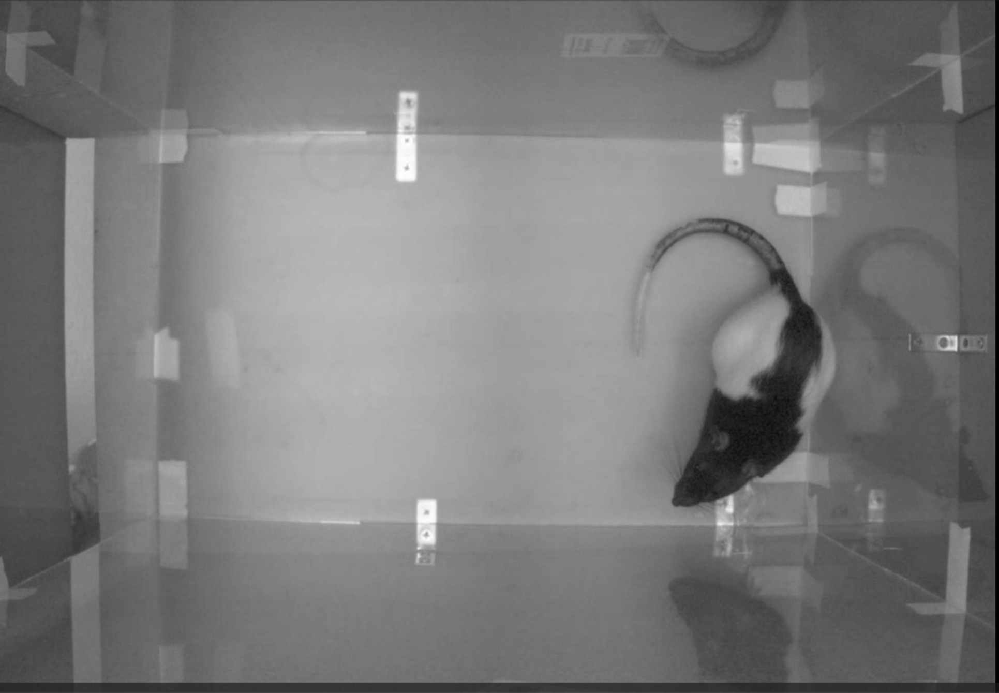

# Setup Guide

Complete setup instructions for H-DaC, including hardware and data preparation.

## Hardware Setup

### Camera Configuration

**Required:** Top-down camera view of the experimental arena

  
   
  <em>Example overhead camera setup for HTR detection</em>

**Key Requirements:**
- Camera positioned directly above the arena
- Clear view of the animal's head and ears
- Sufficient lighting for tracking
- Stable mounting to minimize vibration
- Frame rate: 30+ fps recommended

### Arena Setup

- Clear floor surface (contrasting with animal)
- Adequate lighting (avoid harsh shadows)
- Minimal distractions/noise
- Size appropriate for rodent movement

---

## SLEAP Tracking Setup

### Required Bodypart Labels

Your SLEAP tracking model must include these 5 specific keypoints:

1. **Left Ear** - Lateral edge of left ear
2. **Right Ear** - Lateral edge of right ear  
3. **Head** - Center of head (between ears)
4. **Nose** - Tip of snout
5. **Back** - Base of neck/top of shoulders

  
   
  <em>Required bodypart label positions (overhead view)</em>

### Training Your SLEAP Model

1. **Collect training frames** from your overhead videos
2. **Label the 5 keypoints** consistently across frames
3. **Train the model** following SLEAP documentation
4. **Validate tracking quality** before HTR analysis
   - Check ear tracking precision (critical for ear detector)
   - Verify head/nose tracking stability
   - Ensure consistent back tracking

### Export Requirements

- Export format: **H5 files** (SLEAP's native format)
- Include tracking confidence scores
- Full video tracking (not just selected frames)

---

## Pre-Analysis Checklist

Before using H-DaC, verify:

- [ ] Videos recorded from top-down view
- [ ] SLEAP model tracks all 5 required bodyparts
- [ ] H5 files successfully exported
- [ ] Tracking quality visually inspected
- [ ] Python environment set up with dependencies

---

## Troubleshooting Setup Issues

### Poor Tracking Quality
- Increase lighting uniformity
- Improve background contrast
- Add more training data to SLEAP model
- Check for camera vibration

### Missing Bodyparts
- Verify SLEAP skeleton configuration
- Check that all 5 keypoints are labeled in training
- Review export settings

### H5 File Errors
- Ensure SLEAP export completed successfully
- Check file size (should not be 0 bytes)
- Verify tracks dataset exists in H5 file

---

## Next Steps

Once setup is complete, proceed to:
1. **[Parameter Tuning](parameter_tuning_guide.md)** - Optimize detection parameters
2. **[Workflow Guide](workflow.md)** - Complete analysis workflow

---

*Last Updated: January 2025*
