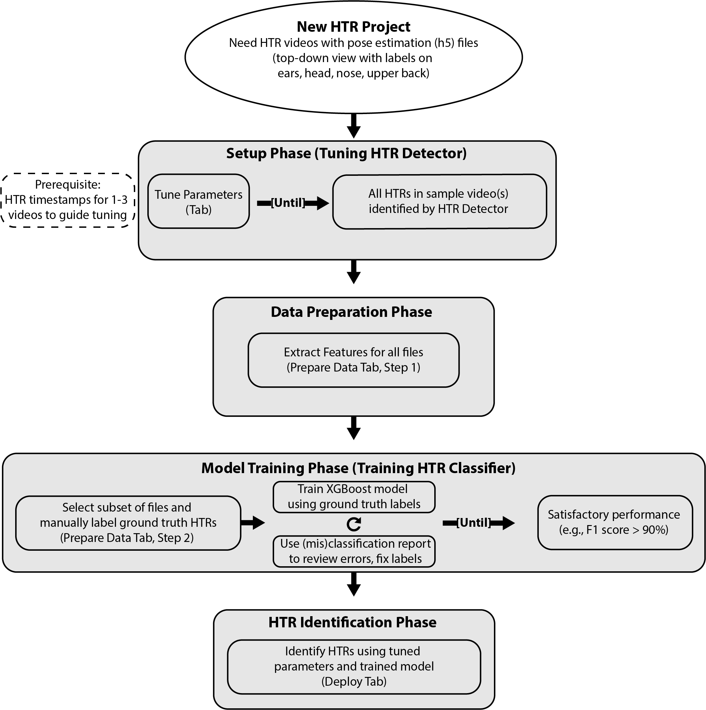

# H-DaC Workflow Guide

Complete guide to using H-DaC for HTR detection and analysis.

---

## Table of Contents

- [Overview](#overview)
- [Deployment Workflows](#deployment-workflows)
  - [Fresh Project Deployment](#deployment-fresh)
  - [Incremental Deployment](#deployment-incremental)
- [Preparation Workflows](#preparation-workflows)
  - [1. Tune Detection Parameters](#tune-parameters)
  - [2. Prepare Data & Label Ground Truth](#prepare-data)
  - [3. Train Your Model](#train-model)
- [Advanced Topics](#advanced-topics)
  - [Parameter Files](#parameter-files)
  - [Node Mapping Configuration](#node-mapping)
  - [Project File Structure](#file-structure)

---

<a name="overview"></a>
## Overview

[Brief introduction to the H-DaC workflow and the 5-tab GUI structure]

**What you'll learn in this guide:**
- How to deploy a trained model for predictions
- How to prepare and train your own detection system
- Best practices for each workflow stage

---

## Workflow Diagram

<p align="center">
  
  <br>
  <em>Complete HTR analysis workflow showing four main phases with "do until" logic for iterative processes</em>
</p>

---

## Deployment Workflows

<a name="deployment-fresh"></a>
### Fresh Project Deployment

**Scenario:** You have a trained model and parameters, and you want to analyze new videos in a fresh project.

**Prerequisites:**
- [List what they need to have ready]

**Steps:**
1. [Step-by-step walkthrough]

**Outputs:**
- [What they'll get at the end]

---

<a name="deployment-incremental"></a>
### Incremental Deployment

**Scenario:** You have an existing project and want to add new videos for analysis.

**Prerequisites:**
- [List what they need to have ready]

**Steps:**
1. [Step-by-step walkthrough]

**Outputs:**
- [What they'll get at the end]

---

## Preparation Workflows

<a name="tune-parameters"></a>
### 1. Tune Detection Parameters

**Tab:** Tune Parameters

**Goal:** [What this step accomplishes]

**When to use this:**
- [Scenarios where parameter tuning is needed]

**Prerequisites:**
- [What they need before starting]

**Steps:**
1. [Detailed walkthrough of the Tune Parameters tab]

**Outputs:**
- [What files/settings they'll have after this]

**Tips:**
- [Best practices and common pitfalls]

---

<a name="prepare-data"></a>
### 2. Prepare Data & Label Ground Truth

**Tab:** Prepare Data

**Goal:** [What this step accomplishes]

**When to use this:**
- [Scenarios where data preparation is needed]

**Prerequisites:**
- [What they need before starting]

**Steps:**

#### Part A: Extract Features
1. [Feature extraction walkthrough]

#### Part B: Label Ground Truth
1. [Ground truth labeling walkthrough]

**Outputs:**
- [What files they'll have after this]

**Tips:**
- [Best practices for labeling, how many samples needed, etc.]

---

<a name="train-model"></a>
### 3. Train Your Model

**Tab:** Train Model

**Goal:** [What this step accomplishes]

**When to use this:**
- [Scenarios where model training is needed]

**Prerequisites:**
- [What they need before starting]

**Steps:**

#### Part A: Configure Training
1. [Training configuration walkthrough]

#### Part B: Evaluate Results
1. [Evaluation and metrics walkthrough]

#### Part C: Iterate and Improve
1. [How to use misclassified events to improve the model]

**Outputs:**
- [What files they'll have after this]

**Understanding the Metrics:**
- [Explanation of precision, recall, F1, confusion matrix]

**When to stop iterating:**
- [Guidelines for acceptable performance]

---

## Advanced Topics

<a name="parameter-files"></a>
### Parameter Files

[How to save, load, and share parameter configurations]

---

<a name="node-mapping"></a>
### Node Mapping Configuration

[Explanation of SLEAP node mapping and how to configure it]

**Common formats:**
- Format 1: [Details]
- Format 2: [Details]

---

<a name="file-structure"></a>
### Project File Structure

[Explanation of the project directory structure and what each folder contains]

```
project_name/
├── input/          # [Description]
├── features/       # [Description]
├── predictions/    # [Description]
├── models/         # [Description]
├── parameters/     # [Description]
└── reports/        # [Description]
```

---

*Last Updated: January 2025*
