# HTR Analysis Workflow Guide

## Complete Workflow with Decision Points

This document describes the complete workflow for HTR (Head-Twitch Response) analysis, including all decision points and iterative refinement cycles.

---

## Interactive Workflow Diagram

```mermaid
flowchart TD
    Start([New HTR Project]) --> HasParams{Have Good<br/>Parameters?}

    HasParams -->|No| Tune[🎯 TUNE PARAMETERS<br/>Tab 2<br/>━━━━━━━━━━<br/>• Load H5/video<br/>• Adjust params<br/>• Visual verify<br/>• Save params]
    HasParams -->|Yes| Extract

    Tune --> Extract[📊 EXTRACT FEATURES<br/>Tab 3: Prepare Data<br/>━━━━━━━━━━<br/>• Load H5 files<br/>• Apply parameters<br/>• Generate CSVs]

    Extract --> HasModel{Have Trained<br/>ML Model?}

    HasModel -->|Yes| Deploy
    HasModel -->|No| HasLabels{Have Ground<br/>Truth Labels?}

    HasLabels -->|Yes| Train
    HasLabels -->|No| Label[🎨 LABEL GROUND TRUTH<br/>Tab 3: CSV Editor<br/>━━━━━━━━━━<br/>• Watch video<br/>• Note HTR times<br/>• Convert to frames<br/>• Edit CSV:<br/>  - 1 = HTR<br/>  - 0 = not HTR]

    Label --> LabelReady{Labeling<br/>Complete?}
    LabelReady -->|No| Label
    LabelReady -->|Yes| Train

    Train[🤖 ML MODEL TRAINING<br/>Tab 4<br/>━━━━━━━━━━<br/>• Load labeled CSVs<br/>• GridSearchCV XGBoost<br/>• Generate model .joblib<br/>• Confusion matrix<br/>• Misclassified CSV] --> Evaluate[📈 EVALUATE<br/>PERFORMANCE<br/>━━━━━━━━━━<br/>• Review confusion matrix<br/>• Check FN misses<br/>• Check FP false alarms]

    Evaluate --> ModelOK{Performance<br/>Acceptable?}

    ModelOK -->|No| Refine[🔄 ITERATIVE REFINEMENT<br/>━━━━━━━━━━<br/>• Review misclassified events<br/>• Watch videos<br/>• Fix label errors<br/>• Add more training data]
    Refine --> Train

    ModelOK -->|Yes| Deploy[🚀 DEPLOY<br/>Tab 5: Batch Processing<br/>━━━━━━━━━━<br/>• Fresh or Incremental mode<br/>• Extract features<br/>• Run predictions<br/>• Generate reports]

    Deploy --> Done([✅ Analysis Complete!])

    style Start fill:#e8f5e9,stroke:#4caf50,stroke-width:3px
    style Tune fill:#e3f2fd,stroke:#2196f3,stroke-width:2px
    style Extract fill:#f3e5f5,stroke:#9c27b0,stroke-width:2px
    style Label fill:#fff3e0,stroke:#ff9800,stroke-width:2px
    style Train fill:#ffe0b2,stroke:#ff5722,stroke-width:2px
    style Evaluate fill:#ffccbc,stroke:#ff5722,stroke-width:2px
    style Refine fill:#ffebee,stroke:#f44336,stroke-width:2px
    style Deploy fill:#c8e6c9,stroke:#4caf50,stroke-width:2px
    style Done fill:#a5d6a7,stroke:#4caf50,stroke-width:3px

    style HasParams fill:#fff9c4,stroke:#fbc02d,stroke-width:2px
    style HasModel fill:#fff9c4,stroke:#fbc02d,stroke-width:2px
    style HasLabels fill:#fff9c4,stroke:#fbc02d,stroke-width:2px
    style LabelReady fill:#fff9c4,stroke:#fbc02d,stroke-width:2px
    style ModelOK fill:#fff9c4,stroke:#fbc02d,stroke-width:2px
```



---

## Workflow Stages

### Stage 1: Tune Parameters
**Purpose:** Optimize HTR detection parameters with visual feedback

**Inputs:**
- H5 tracking files (SLEAP output)
- Optional: Video files for visualization
- Default parameters (head/ear detection thresholds)

**Process:**
1. Load H5 file and corresponding video
2. Adjust detection parameters in real-time
3. Visualize HTR candidates on video
4. Fine-tune until satisfied with detection sensitivity
5. Save optimized parameters to JSON

**Outputs:**
- Parameter configuration file (JSON)

**When to Skip:** If you already have well-tested parameters from previous projects

---

### Stage 2: Extract Features
**Purpose:** Generate machine learning features from H5 tracking data

**Inputs:**
- H5 tracking files
- Parameter configuration (from Stage 1 or existing)

**Process:**
1. Load H5 files from project input/ folder
2. Apply detection parameters
3. Extract temporal and spatial features for each HTR candidate
4. Generate feature CSV files with `ground_truth` column set to `__` (unlabeled)

**Outputs:**
- Feature CSV files (one per H5 file) in `features/` folder
- Columns: start_frame, end_frame, 35+ feature columns, ground_truth

**Note:** This stage supports **incremental processing** - if you add new H5 files later, you can extract features for only the new files

---

### Stage 3: Label Ground Truth
**Purpose:** Create training data by labeling true HTR events

**Inputs:**
- Feature CSV files from Stage 2
- Manually scored HTR timestamps (from video observation)
- Access to original videos for verification

**Process:**
1. Watch videos and note HTR timestamps
2. Convert timestamps to frame numbers
3. Load feature CSV in editor
4. Find corresponding rows by frame ranges
5. Set `ground_truth` column:
   - `1` = True HTR event
   - `0` = Not an HTR (false positive candidate)
   - `__` = Unlabeled (skip)

**Outputs:**
- Labeled feature CSV files ready for ML training
- Progress tracking: X% of candidates labeled

**Tips:**
- Start with a subset (100-200 examples minimum)
- Balance positive (HTR) and negative (non-HTR) examples
- You can iterate - add more labels after initial training

---

### Stage 4: ML Model Training
**Purpose:** Train XGBoost classifier to predict HTR events

**Inputs:**
- Labeled feature CSV files from Stage 3
- Optional: Custom ML hyperparameter grid

**Process:**
1. Load all labeled data (filter out `__` rows)
2. Split into train/test sets (80/20, stratified)
3. Run GridSearchCV to find best hyperparameters:
   - `n_estimators`: Number of boosting rounds
   - `max_depth`: Maximum tree depth
   - `learning_rate`: Step size shrinkage
   - `subsample`: Training instance sampling ratio
   - `colsample_bytree`: Feature sampling ratio
4. Train best model on full training set
5. Evaluate on test set

**Outputs:**
- Trained model file (.joblib)
- Confusion matrix plot (PNG)
- Feature importance plot (PNG)
- Classification report (precision, recall, F1-score)
- **Misclassified events CSV** - critical for iteration

**Training Time:** 2-10 minutes depending on dataset size

---

### Stage 5: Evaluate Model Performance
**Purpose:** Assess model quality and identify labeling issues

**Inputs:**
- Trained model from Stage 4
- Test set predictions
- Misclassified events CSV

**Key Metrics:**
- **Precision:** Of predicted HTRs, what % are real? (False Positive rate)
- **Recall:** Of real HTRs, what % did we catch? (False Negative rate)
- **F1-Score:** Harmonic mean of precision and recall

**Confusion Matrix Analysis:**
```
                   Predicted
                 No HTR    HTR
Actual  No HTR     TN      FP  ← False Alarms
        HTR        FN      TP  ← Misses
```

**Decision Point:** Is performance acceptable?
- **Precision < 80%?** → Many false alarms, review FP cases
- **Recall < 80%?** → Missing real HTRs, review FN cases
- **Both good?** → Proceed to batch processing

---

### Stage 6: Iterative Refinement
**Purpose:** Improve model by fixing labeling errors

**Process:**
1. Open misclassified events CSV
2. For each False Negative (missed HTR):
   - Watch video at that timestamp
   - Was it actually an HTR we missed? → Change label to `1`
   - Or was our manual scoring wrong? → Keep label as `0`
3. For each False Positive (false alarm):
   - Watch video at that timestamp
   - Was it actually an HTR we didn't score? → Change label to `1`
   - Or is it correctly not an HTR? → Keep label as `0`
4. Optional: Add more labeled examples from unlabeled data
5. Save updated labels
6. Retrain model (return to Stage 4)
7. Re-evaluate (return to Stage 5)

**Iteration Cycle:**
```
Train → Evaluate → Review Errors → Fix Labels → Train → ...
```

**When to Stop:**
- Performance plateaus (no improvement after 2-3 iterations)
- Metrics meet your requirements (e.g., F1 > 0.90)
- Diminishing returns on time investment

---

### Stage 7: Batch Processing
**Purpose:** Deploy trained model to analyze production data

**Two Modes:**

#### Mode A: Fresh Batch (New Project)
**Use Case:** First-time processing of a new dataset

**Process:**
1. Create new project
2. Copy H5 files to input/ folder
3. Copy trained model to models/ folder
4. Run full pipeline:
   - Extract features (all files)
   - Predict HTRs (all files)
   - Generate consolidated report

#### Mode B: Incremental Batch (Existing Project)
**Use Case:** Adding new data to an existing analysis

**Process:**
1. Add new H5 files to input/ folder
2. GUI detects new files automatically
3. Choose processing mode:
   - **Incremental:** Process only new files, update existing report
   - **Full Refresh:** Reprocess all files, generate new report

**Outputs:**
- Prediction CSV files (one per H5 file) in `predictions/` folder
- Consolidated Excel report in `reports/` folder:
  - Per-file HTR counts
  - Timestamp information
  - Confidence scores

---

## Decision Points Summary

| Decision Point | Location | YES Path | NO Path |
|----------------|----------|----------|---------|
| Have good parameters? | Start | Skip to Extract Features | Tune Parameters |
| Have trained model? | After Feature Extraction | Skip to Batch Processing | Need to train |
| Have ground truth? | Before Training | Train Model | Label Data |
| Labeling complete? | During Labeling | Train Model | Continue labeling |
| Model acceptable? | After Training | Deploy to Batch | Iterative Refinement |

---

## File Structure

```
project_name/
├── input/                          # H5 tracking files
│   ├── rat001_session1.h5
│   └── rat002_session1.h5
├── features/                       # Extracted features
│   ├── rat001_session1_features.csv
│   └── rat002_session1_features.csv
├── predictions/                    # Model predictions
│   ├── rat001_session1_predictions.csv
│   └── rat002_session1_predictions.csv
├── models/                         # Trained models
│   ├── htr_model_20250115.joblib
│   └── htr_model_20250116.joblib
├── parameters/                     # Detection parameters
│   └── optimized_params_20250115.json
└── reports/                        # Final reports
    └── HTR_Analysis_Report_20250115.xlsx
```

---

## Common Workflows

### Workflow 1: Complete First-Time Analysis
```
Tune Parameters → Extract Features → Label Data → Train Model →
Evaluate → [Refine Loop] → Batch Process
```
**Timeline:** 1-3 days

### Workflow 2: Using Pre-Trained Model
```
(Skip to) Extract Features → Batch Process
```
**Timeline:** Hours

### Workflow 3: Improving Existing Model
```
Label More Data → Retrain → Evaluate → Deploy
```
**Timeline:** Few hours

### Workflow 4: Incremental Data Addition
```
Add new H5 files → Incremental Batch Process
```
**Timeline:** Minutes

---

## Best Practices

1. **Start Small:** Label 100-200 examples initially, then iterate
2. **Balance Classes:** Aim for similar numbers of HTR (1) and non-HTR (0) labels
3. **Document Decisions:** Note why you labeled ambiguous cases
4. **Version Control:** Save models with timestamps
5. **Validate Visually:** Always review some predictions against video
6. **Iterate Systematically:** Fix one type of error at a time
7. **Track Metrics:** Log performance across iterations

---

## Troubleshooting

### Poor Recall (Missing HTRs)
- Review missed events in video
- Check if detection parameters are too strict
- Add more positive examples (true HTRs) to training data

### Poor Precision (Too Many False Alarms)
- Review false positives in video
- Add more negative examples (non-HTR movements) to training data
- Consider stricter confidence threshold

### Model Not Improving with Iteration
- Check class balance (too many of one class?)
- Verify labels are consistent
- May need more diverse training examples
- Consider if features capture the behavior well

---

## Glossary

- **H5 File:** SLEAP tracking data (HDF5 format)
- **Feature Extraction:** Converting raw tracking to ML features
- **Ground Truth:** Manually verified HTR labels (1 = HTR, 0 = not HTR)
- **GridSearchCV:** Automated hyperparameter optimization
- **False Positive (FP):** Model predicted HTR when it wasn't
- **False Negative (FN):** Model missed a real HTR
- **Precision:** Accuracy of positive predictions
- **Recall:** Completeness of positive predictions (sensitivity)
- **F1-Score:** Balance between precision and recall

---

*Last Updated: 2025-10-15*
